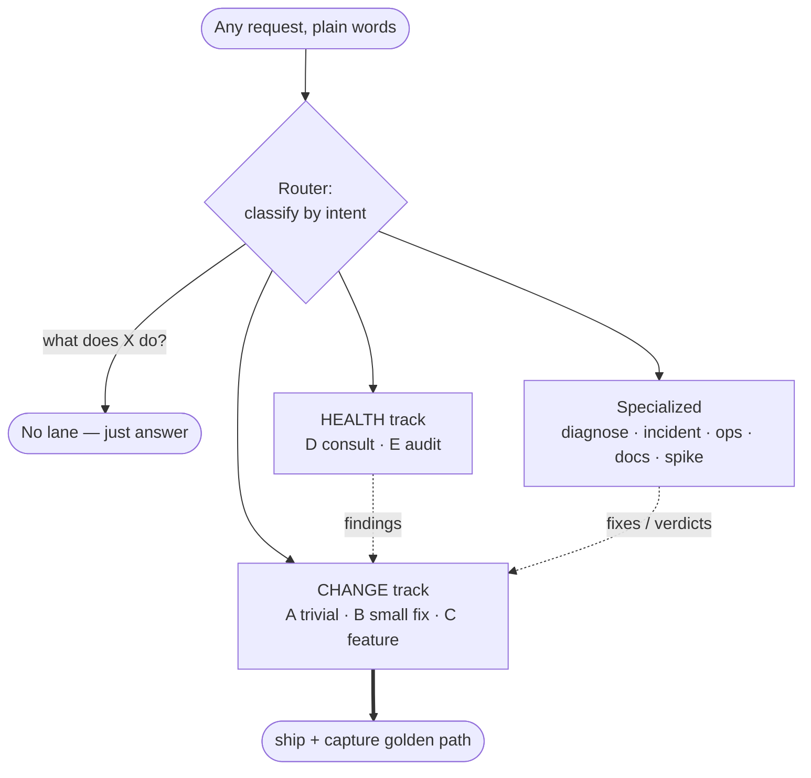
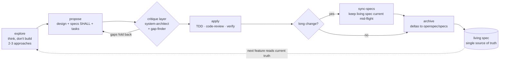
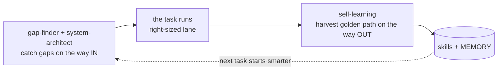

# claude-config

A personal [Claude Code](https://docs.claude.com/en/docs/claude-code) configuration — agents, skills, commands, and settings — that turns fast, chaotic AI-assisted development into a disciplined, right-sized workflow. Its center is a single **router skill** that reads any request in plain language, decides *what kind of task it is*, and routes it to the right specialist with exactly as much process as it warrants — no more, no less. This repo is the versioned backup of that setup and an explanation of the approach behind it.

---

## The problem

If you build with AI every day, the bottleneck stops being *typing code* and becomes *keeping the work coherent*. The failure modes are specific and repeat:

- **Too many overlapping agents, no clear owner.** You collect a dozen specialists and then freeze at the front door. Is this a `frontend-developer` job, a `make-interfaces-feel-better` job, or a `ui-ux-designer` job? Is restructuring a module `system-architect` or `backend-architect`? Does reviewing a diff go to `code-reviewer` or `gap-finder`? The names overlap, so you either pick wrong or pick nothing.
- **Every task gets the same process — or none.** A one-line copy tweak and a payments feature get treated identically. Either everything drowns in ceremony, or nothing does and the money-touching change ships with the same rigor as a rename.
- **Survivorship bias / unknown-unknowns.** You handle the cases you can see and silently skip the ones you don't know you skipped: empty states, timezones and DST, idempotency and double-submit, back-compat migrations. Nothing reminds you of the case you forgot because you forgot it.
- **Juggling 3–4 problems in one repo.** Parallel work in a single working tree means half-finished changes for different problems collide, and one commit clobbers another.
- **Incidents forced through heavy process.** Prod is down and the workflow wants a design doc. So you abandon the workflow entirely under pressure — and now the fix has no record at all.
- **Hard-won knowledge evaporates.** How to reach the prod DB, the one gotcha that cost you an afternoon, the exact deploy dance — you re-derive it next session because nothing captured it.
- **No live spec.** Six months of dated design docs describe what you *intended* at various past moments. None of them describes what the system *does now*. The docs rot; the code moves on.

None of these is a coding problem. They're all *routing and discipline* problems — deciding which task deserves which treatment, and making that decision the same way every time.

---

## The idea

**One front door.** Every request — feature, fix, "why is this broken", prod fire, deploy, "is this file too big", a plain question — enters through a single router skill (`derflow`). You describe the problem in plain words. You do **not** have to know which agent to call.

The router does three things:

1. **Classifies** the request into a **lane** by *intent* — what you're really trying to do, not which keyword you used.
2. **Routes** it to the right specialist (or to no specialist, for trivial work).
3. **Right-sizes the ceremony** — a rename gets "just do it plus a test"; a payments feature gets the full spec cycle; an incident gets a fast path that *skips* the spec cycle on purpose.

Crucially, the decision is **announced** before any work happens. The router states one line — `Lane <id> → <agent> — because <reason>` — so the routing is observable and correctable, not a black box. A plain question ("what does X do?") is explicitly *not work*: no lane, no announce, just an answer.

---

## The router



The key move: **diagnosis, consults, audits, and spikes don't ship anything themselves.** They produce findings or a verdict, and each accepted finding *re-enters the front door* as an A/B/C change. An audit is not "a report to file"; it's a queue of routed tasks.

---

## The lanes

| Lane | Trigger | Process | Route |
|---|---|---|---|
| **— no lane** | "explain X / what does this do" | none — just answer | — |
| **A · trivial** | rename, config value, copy tweak | do it + a test | no specialist, no spec |
| **B · small fix** | you know *what* to change (wonky modal, missing field) | specialist + light gate (a test, or `/verify` for pure-visual) + commit | disambiguated specialist |
| **C · real feature** | ambiguous, or touches money/auth/personal-data/public-contract/schema, or >half-day, or multi-session | full openspec cycle, living spec updated | openspec + `apply` disciplines |
| **C-bootstrap** | new project / "global projection" | brainstorm + decomposition → seed baseline `openspec/specs` | then features flow as C |
| **Dx · diagnose** | "X is broken — why?" (don't yet know the fix) | reproduce → root-cause **first** | `systematic-debugging`, then A/B/C |
| **F · incident** | "prod is on fire, fix now" | minimal ceremony; retro-spec **after** | fast-path; bypasses C's full cycle |
| **Ops** | deploy, migrate, restart, broadcast, rotate key | dry-run/preview, migration-ID check, backup, verify, known rollback | not a code-authoring lane |
| **Docs** | "document X / sync docs to code" | docs = source of truth | `documentation-expert` |
| **Spike** | "can we even do X? try it" | throwaway build-to-learn, no gate, no commit → **verdict** | re-enter as C, or discard |
| **D · consult** | "is this file too big / is this design ok?" | verdict only, changes nothing | `system-architect` or `simplify` → A/B/C |
| **E · audit** | "we've built a while — audit everything" | multi-dimension review → ranked findings | each finding → A/B/C |

The two normal "tracks" are **Change** (A/B/C — you're modifying the system) and **Health** (D/E — you're evaluating it). Everything else is a specialized intent that eventually feeds back into a Change lane.

---

## Lane C — the openspec cycle

Real features run on **openspec** as the backbone: a local `openspec/` directory per repo that holds a *living, queryable spec* of what the system does now. A change is proposed, applied under discipline, then its deltas are folded into the living spec and the change is archived.



openspec gives structure and cumulative memory but has **zero quality gates** in its apply step. So `apply` folds in the execution disciplines from [superpowers](https://github.com/obra/superpowers): **test-driven-development**, **requesting-code-review**, and **verification-before-completion**. Schema or contract changes are never a bare edit — the migration, expand/contract back-compat, and rollback are produced *as part of the same task*.

A companion gate guards **external integrations**: before a parser or serializer is written against a third-party API, SDK, or device, its real wire-contract — the vendor's field-exact reference, or a captured live response — has to be in hand. A guessed parser carrying a `verify on live` promise does not ship, and "confirm the exact fields on the live device later" is guessing wearing a plan's authority — the review gate rejects it rather than passing it as plan-mandated. (This gate exists because a skipped one cost days of one-field-at-a-time production debugging.)

The gate binds *claims*, not just code. Any statement that an external API can't do something, or doesn't return some field — made in design, in architecture review, anywhere — has to trace back to the vendor's contract or a captured sample, never to our own code. Our parser only shows what we bothered to extract, not what the API actually sends; a feasibility verdict drawn from it can kill a real feature on a false premise. One nearly did: an architect ruled phone-match login impossible because "the payment webhook returns no payer phone" — read off our own parser, which never looked. The vendor's documented payload had the phone field all along.

One rule keeps the spec trustworthy: **there is exactly one source of truth, `openspec/specs`.** Parallel design-doc trees are not maintained alongside it — that's how docs go stale in the first place.

A project that hasn't bootstrapped openspec yet just runs `openspec init` — it does **not** fall back to a pile of dated design docs. Those design docs are *history* (why a thing was built at some past moment), not a competing live spec. When work touches a seam that has no openspec baseline yet, that seam is adopted into openspec — **warm-started** from any existing design doc but **verified against the code**, since the doc is a dated claim and the code is the truth — and the old doc gets a pointer to its successor so history can't pose as the current spec. New subsystems skip all of that: they're authored in openspec from the first line. Adoption is lazy, one touched seam at a time; a full audit-and-drain is an optional accelerator, never an entry ticket. And `init` lands when you move from exploring to proposing — the brainstorm writes nothing to openspec, so thinking first without one is correct, not falling behind.

There's a subtler failure than routing to the wrong place: routing *right* and then drifting. The explore phase borrows the *technique* of a brainstorming skill — one question at a time, two or three approaches — but that skill is self-contained, and its own checklist ends by writing a design doc to `docs/superpowers/specs/` and handing off to a planning skill. Over a long brainstorm that built-in ending reasserts itself and quietly overrides the openspec plan the agent announced at the start — a correct decision decaying into a delegate's default. So the technique is borrowed but the terminus is void: the spec is authored in openspec, no parallel design doc, no separate planning pass, and the rule is restated at the hand-off from exploring to proposing — because announcing it once, at the top, isn't enough to survive to the end.

The explore phase has one last trap, and it's a collision of names. Lane C's *explore* is design-thinking seeded by the living spec — read what the spec already says, then read only the specific code the change will actually touch (the exact serialized shape about to land in a table, say). It is *not* `explore-code`, the unfamiliar-repo reconnaissance from the next section. A small project that already has an `openspec/` — one you built yourself days ago — is not unfamiliar, and fanning out reconnaissance agents to "map its architecture" spends a whole survey to answer what the spec plus two files would. The same phase hides a quieter waste: delegating that reading to background agents *and* re-reading the same files by hand pays for both at once — a subagent exists to keep the reading out of your context and hand back a distillate, so it's one or the other, never both. (Written from a real one: a first-from-scratch feature on a tiny fresh app burned ~50k tokens — two broad exploration agents plus a dozen hand-reads of the same surface — to establish a single fact, the current serialized shape of the thing being stored.)

Content-heavy work draws a second boundary. A selling site or landing page is two layers, and they don't share a home. What the site *does* — routes, lead and ticket flows, validation — is behavior, and it belongs in openspec. What the site *says* — positioning, offer, pricing, copy, narrative — is marketing, and it lives in the marketing skills' own homes (`.agents/product-marketing.md`, offer and copy docs), never as an openspec requirement. A requirement is code-checkable; "the hero conveys built-by-practitioners" is not. Forcing copy into the spec is just another way to make the spec lie.

---

## Orienting in an unfamiliar codebase

openspec assumes the spec *leads* the code. A huge existing repo — freshly cloned, no specs — inverts that: the code leads, and understanding has to catch up. That's a gap between the greenfield bootstrap and the delta-sync cycle, and two skills fill it, both over a shared engine (`_orient-engine`).

The first instinct was a recursive decomposition **tree** — project → sub-projects → leaves. A frame-challenge (the same `system-architect` + `gap-finder` pass the lanes use) killed it as the *model*: real software is a **graph**, not a tree. Containment throws away the edges — who calls whom, blast radius, cycles, the shared util everyone depends on — which is exactly what makes a codebase tractable. Worse, a tree can't express *importance*, so the design leaned on asking the human — precisely the person who just cloned the repo and cannot answer. The reframe: **the graph is the model, the tree is only an index, and importance is measured** (fan-in × git-churn × centrality), never guessed. Every node fact is tagged by provenance — measured vs. inferred vs. asked — so a confident guess never masquerades as truth.

Two rules live in that shared engine and pull in the same direction. **Docs lead, code verifies:** a cheap read of README and docstrings comes *first* — for the *intent* the code can't state — but only as a hypothesis the code then confirms; where they diverge, the docs are stale. Docs-lead is not docs-*only*, though — user-facing and selling copy live in code, so "not in the docs" is never "not in the repo." And **absence needs a coverage proof, not just a trail:** before concluding something isn't there, enumerate the surface (`git ls-files` extensions, sub-projects) and search *without* an assumed-stack allowlist — a Python repo can hide a hundred `.vue` files — then answer, out loud, *searched, but everywhere?* A trail nobody interrogates won't catch a bad search; the challenge does.

- **`explore-code`** — an *unknown* repo. Not "draw the whole tree" but **trace how it actually works**: find the real entry points, discover the seams, and follow the top handful of golden paths end-to-end through the layers. Lazy and path-driven — you drill only where you're headed. The human is asked one cheap, answerable thing (*what does this do / what are you trying to do*), never about importance. Notes are disposable; the phase ends by handing seams + paths into the real task.
- **`audit-code`** — your *own* repo, for documentation, debugging, and catching bad decisions. Measure the whole graph cheaply with existing tools, then fan out `gap-finder` over only the top-N hotspots (by fan-in × churn) — and *say what you skipped*, no silent truncation. The worst "bad decisions" are omissions, so the rich pass carries an **expected-but-absent** checklist, not just smells. Output is persisted but **freshness-bound**: every node stamped with the commit it came from, re-verified by git-diff, so it can detect its own staleness instead of quietly lying. Because that rich pass spawns one agent per hotspot, it's *expensive by design* — the hotspot set is capped and the token cost estimated **before** the fan-out, never tallied after, so a "quick audit" can't quietly run into the millions. And it earns that cost only when illuminating the repo *is* the goal: to merely warm up a change to one seam, the scoped, lazy `explore-code` is the right tool — reaching for a whole-repo audit to prep a single feature spends a fan-out to answer a one-seam question. (Written from a real one: an "audit this so I can add a feature" spun up dozens of workers and ~3M tokens when a scoped explore was the ask.)

Orient is a *phase*, not a lane that owns a standing artifact — it terminates and feeds the work downstream (an `audit-code` pass is the front half of adopting a brownfield project into openspec).

**`adopt-code`** is the back half — turning an unspecced codebase into a living openspec baseline. Reverse-engineering can only produce *description* ("what the code does"), never *intent* ("what it SHALL do"), so the flow is two-status: archaeology drafts **descriptive** SHALLs per seam, each anchored to the code it was read from, and you **promote** the ones that are actually intended to **normative** — flagging the rest as bugs or deferring them. It also runs the *expected-but-absent* checklist, so a confirmed omission becomes an `unbacked` SHALL (a known gap that queues a feature) rather than staying invisible. A **conformance-sweep** then guards only the normative SHALLs across three axes — code↔spec, spec↔memory, memory↔code — at adoption and again as a gate on every later change to that seam, so the spec can't quietly drift from the code. The rhythm is hybrid: on-demand at the edge of work (a change to an unspecced seam wedges adoption first), with an optional full baseline pass. That closes the loop: **explore-code / audit-code → adopt-code → normal Lane C.**

---

## Critique in, capture out

Two cross-cutting layers wrap the lanes, and they're symmetric. One catches gaps on the way **in**; the other harvests knowledge on the way **out**. Together they're what make the workflow *compound* — every hard task makes the next one cheaper.

**Critique (way in).** Plugged into transitions — after a brainstorm, after mocks, after a spec, after code:
- **`system-architect`** — structural critique: boundaries, trade-offs, how to decompose. Run on a fresh spec.
- **`gap-finder`** — the absence lens. Its one job is to surface what's *missing* — the field, state, path, or guarantee that should exist and doesn't and that you don't know you forgot. It never judges correctness of what's there (that's `/code-review`). Its method is what makes it useful rather than noise: **it grounds every gap in your actual codebase by comparing to siblings.** "Other booking modals in this repo debounce double-submit; this one doesn't" beats a generic "consider double-submit." It uses categories (empty states, timezones, idempotency, money edges, migrations…) only as seeds — each must be instantiated against the real artifact or dropped — and ranks by real-world likelihood, not theory. This is the direct antidote to survivorship bias.

There's also a **trigger** on the way in: when you hand the workflow a *pre-baked solution* ("let's build it as X") instead of a problem, the frame gets challenged **first** — `system-architect` on the premise — before any detail brainstorming. A supplied answer is the signal that the question was skipped. (This section itself exists because that trigger once didn't fire, and the fix was to make it explicit.)

A critique only counts once its fixes reach the spec that *governs*. When `system-architect` or `gap-finder` returns numbered resolutions, each has to land as a **normative SHALL** in the spec — not as prose in the design doc beside it. The conformance-sweep enforces the spec, not the design; a resolution that lives only in design isn't binding and quietly reopens at implementation. So "resolved" is verified by reading the spec and mapping each resolution to a requirement, never taken on the reviewer's summary.

**Capture (way out).** When a task produced a non-obvious win — a Lane C feature with gotchas, an incident root-cause, an ops procedure figured out the hard way — the **self-learning** layer harvests it:
- reusable multi-step procedure → a new **skill**
- single fact / gotcha / path → a line in **MEMORY**
- unverified hunch → a *tentative* note, not a skill (promotion requires a passing check, a named failure mode, and one ruled-out dead-end)



The capture step is triggered *proactively* — the moment a task took several tries or surfaced a project fact you didn't know up front, not when someone asks for a write-up.

Capture has a quieter twin: **hygiene**. Adding memory forever grows the index until it silently overflows the load budget and gets truncated — memory lost with no warning. So the index stays terse pointers only, detail pushed down into the per-memory file; it's compacted *before* it hits the limit, not after; and superseded notes are periodically folded together and wrong ones deleted. This is a memory discipline, not a code one — auditing the codebase never touches it, which is exactly why reaching for a code audit to prevent memory bloat aims at the wrong layer.

---

## Picking the right agent

The disambiguation principle is one line: **route by intent, not by keyword.** The sharpest distinction is **design vs build**.

- `*-architect` agents decide *shape* when it's non-obvious or new — schema, API surface, module boundaries. Reach for them only when the data model or contract genuinely needs a *decision*.
- `python-pro` / `frontend-developer` *implement* when the shape is already clear. A one-field add or a straightforward endpoint is **build**, not design.

The overlaps that actually bite, resolved:

| Situation | Use | Not |
|---|---|---|
| Build / add / change UI structure or wiring | `frontend-developer` | make-interfaces, ui-ux-designer |
| UI works but "feels off / cheap" — spacing, radii, motion | `make-interfaces-feel-better` | frontend-developer |
| "Is this the right flow / layout / accessible?" | `ui-ux-designer` | frontend-developer |
| Whole-system shape, boundaries, "should this be split", file too big | `system-architect` | backend-architect |
| Concrete API design, DB schema, endpoint/service design | `backend-architect` | system-architect |
| What's **missing** (omissions, forgot-a-case) | `gap-finder` | code-reviewer |
| Bugs/correctness + quality of what's **there**, on the diff | `/code-review` (`ultra` = deep) | gap-finder |
| Apply reuse/simplification/cleanup | `simplify` | /code-review |
| Root-cause a bug / unexpected behavior | `systematic-debugging` | code-reviewer |
| Implement/optimize Python specifically | `python-pro` | frontend-developer |
| Write/refresh docs, README, API docs | `documentation-expert` | copywriting |
| Make a Russian text sound native (not translationese/канцелярит) | `dertext` | documentation-expert (explains), copywriting (sells) |

When two agents still fit, prefer the **narrower** one — and say why in the announce line.

The same design-vs-build line has a sharp edge in the UI. Dropping a new element into a constrained surface — a modal, a toolbar, a card — reads like a build ("just add the field"), but it's a layout *decision*: where it goes, what it displaces, whether the container still holds it. That's design. So it isn't crammed in silently — the move is to propose a couple of placements, or check the surface's convention, or ask the `ui-ux-designer`, or ask the human where it belongs — and then to *look at the render*, because for a UI change the verification contour is visual. A scrollbar that wasn't there before is a regression, not a finished change. (Written from a real one: a warning line was wedged into an event modal, a scrollbar appeared, and nobody had been asked where the line should live.)

There's a layer beneath even that. Sometimes "X isn't shown" doesn't mean the field is missing — it means the *model* has no X, or no way to derive one. "I'm the organizer, but who's the legal entity?" is not a request for a text input; it's a data-model gap, no path from organizer to legal entity. Drawing the field first just ships something tidy that still can't answer the question. So before the placement question, there's an origin question — what does this value come from? — and that's a `gap-finder` look at the domain, not a pixel.

---

## Parallel work

Several problems in one repo at once is the direct cause of git collisions and clobbered commits. The fix is structural, not careful-manual: **one git worktree + branch per problem**, via superpowers' `using-git-worktrees`. Never let uncommitted changes for different problems share a working tree — that shared tree *is* the collision.

And a session is blind to its siblings: five sessions can be editing one repo at once and none of them can see the other four. So isolation can't wait to be *noticed* — it has to be structural and by-default. When a repo is worked in parallel, every file-editing task carves its own worktree and branch *before its first edit*, and then it needs no awareness of the others at all — separate working copies, merge at the end, which is exactly how a thousand developers share one project. The one thing no tool can dissolve is two tasks editing the *same lines*: that conflicts at merge, gets sequenced and resolved by hand, and that's git working as designed, not a failure. Because an agent can't detect that it's running in parallel, the fact is declared in the repo's own always-loaded instructions rather than left to a skill rule that drifts out of attention.

A common mistake is expecting `context-manager` to solve this. It doesn't: `context-manager` preserves *conversation* context across agents; it does nothing about git. Different problem, different tool.

Isolation also has to re-fire *within* a session. Carving a branch per problem at the start isn't enough, because a new request arriving mid-session is a new problem — the classic slip is being on a feature branch, getting asked to fix a nearby bug, and committing the fix onto the feature, where it can't ship without dragging the half-done feature along. So every new request re-asks the ownership question before its first edit: same problem as this branch, or a different one that needs its own branch off `main`? An agent can't reliably notice this on its own, so the current branch and its uncommitted count are surfaced every turn by a hook — the same move as declaring parallelism in `CLAUDE.md`: make the fact ambient rather than remembered.

And worktree isolation has a blind spot: it guards the *git tree*, not the **deploy target**. The running server — the built `dist/`, the artifact on the box — is a second shared, mutable surface that a per-problem worktree never touches. Two sessions can each build from their own branch and push over the same server, and the last writer wins. So a deploy is a *serialized op on shared state*, like a migration: artifacts ship **only from merged canonical (`main`)**, never from a local unmerged branch — if it isn't merged, its build doesn't go to prod — and the deployer owns the whole artifact set, not a slice of it. Verification follows the same tightening: check the **active served chain** end-to-end (the entry HTML → its chunk → a behavior marker in that chunk), not "the file is on disk," and *re-check after a delay*, because a concurrent deploy can clobber a green result minutes later. (Written from a real one: a merged frontend deploy was silently overwritten fifteen minutes later by a parallel session building from its own unmerged branch — backend intact, the new buttons simply gone.)

A related boundary is *which project owns a task at all.* Work happens in the project whose context it needs — its directory is its session is its memory — and across a project boundary only the **distillate** travels: a finding, a lesson, a rule, never raw context. This meta-repo is where that plays out cleanly: every gate in it arrived as a distilled lesson from a real project's session (an incident, a friction, a miss), never by dragging that project's product work in here. Doing a project's research or feature *in the tooling repo* would pollute the tooling's own context and memory with facts that belong elsewhere. A cross-project skill is the clean example — it runs in the project that holds the material, but its learned rules write back to the global skill store: the material stays put, the distilled rule travels.

The **verify gate** applies to any lane that ships code: run the check at the *highest-fidelity contour available* — local test DB → staging → prod-smoke — and state which one you ran. The workflow doesn't depend on which contours exist yet; it runs the best one present.

And handing that check to the human is not the check. "Done, go try it" — with the thing never once exercised — is a claim without evidence; the floor is one successful run of what was built, by the agent, before it says done. Authentication isn't an escape hatch: an authenticated page is testable without real credentials, because a test client can force-login and hit exactly the 500-on-load a browser would. When even that contour is out of reach, the honest output is a loud "not verified — this is untested, here's the risk," never a silent hand-off dressed up as completion. (This one is written from a real miss: a whole section shipped as done and returned an HTTP 500 on the very first load.)

---

## Install / restore

**`~/.claude` *is* the repo** — not a copy of it. The working tree lives in place, so editing a skill *is* a change in the repo and `git status` is the truth about what has drifted. A whitelist `.gitignore` admits only `CLAUDE.md README.md settings.json agents/ skills/ schemas/`; everything else — sessions, history, caches, plugins, `.credentials.json` — is excluded by construction rather than by enumeration, so a new file added by a future Claude Code release cannot leak in unnoticed.

`settings.local.json` is deliberately **not** versioned: by Claude Code convention `*.local.json` is machine-local, and that is exactly where machine-specific permissions and secrets accumulate.

To set up a fresh machine:

```bash
cd ~/.claude
git init -b main
git remote add origin git@github.com:DerAlSem/derflow.git
git fetch origin && git reset --hard origin/main
```

After editing any skill or agent, push it back:

```bash
cd ~/.claude && git add -A && git commit -m "..." && git push
```

**Dependencies.**

- **openspec** — the spec backbone for Lane C. It is an **npm CLI, not a Claude Code plugin**: `npm install -g @fission-ai/openspec`, then `openspec init` per project and `openspec update` after each upgrade. Needs Node 20.19+. The twelve `/opsx:` commands require the expanded workflow set (`openspec config set profile custom` plus the workflow list).
- **superpowers** (plugin, via `/plugin`) — execution disciplines folded into `apply`: TDD, code review, verification-before-completion, plus `systematic-debugging` and `using-git-worktrees`.
- **marketing-skills** (plugin) — the layer openspec deliberately does not hold: positioning, offer, pricing, copy.
- **self-learning** (plugin) — capture outside a change.

The **schema** (`schemas/derflow-spec/`) is versioned here and copied into each project's `openspec/schemas/`. It adds an adversarial `review` gate, a `test-plan` binding every scenario to a named test, and an evidence-first `retrospective`. It derives from the `anvil` and `superpowers-bridge` community schemas, with the retrospective rewritten to drop the superpowers dependency — so the schema rides **one** moving dependency instead of two.

The **make-interfaces-feel-better** skill and the agents in `agents/` are vendored and **deliberately pinned**, not converted to plugins. Three reasons, decided 2026-07-25: granular install isn't supported (seven agents would arrive as seven bundles, flooding the router's deliberately small target set); local edits (`model: inherit`, filename-to-`name:` renames) would be reverted on install; and for a router whose disambiguation table names its targets by hand, an auto-updating agent prompt is routing behaviour changing silently. See `agents/VENDOR.md`.

---

## Credits

- [Claude Code](https://docs.claude.com/en/docs/claude-code) — Anthropic.
- **superpowers** — execution-discipline skills plugin ([obra/superpowers](https://github.com/obra/superpowers)).
- **openspec** — living-spec toolchain (the `openspec` CLI); the Lane C backbone.
- **self-learning** — the capture layer, by [kulaxyz](https://github.com/Kulaxyz/self-learning-skills).
- **make-interfaces-feel-better** — UI-polish skill (design-engineering principles).
- **ui-ux-designer** agent — by Madina Gbotoe ([portfolio](https://github.com/madinagbotoe), CC BY 4.0); attribution retained.
- The role agents (`frontend-developer`, `python-pro`, `system-architect`, `ui-ux-designer`) derive from the wshobson/agents collection; `ui-ux-designer` is by Madina Gbotoe (CC BY 4.0, attribution retained). The `gap-finder` agent and the `derflow` router are original to this repo. Only five agents are admitted — selected by measured invocation counts from session logs, not by taste.
